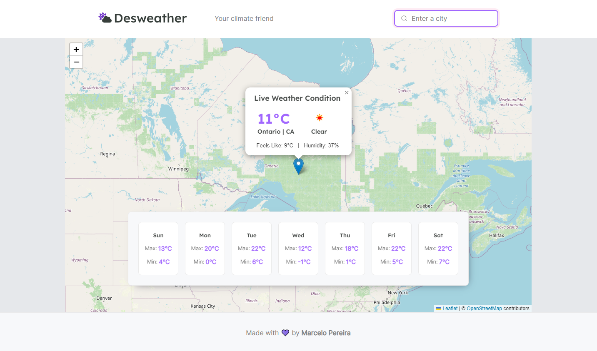

<h1 align="center">
    
</h1>

<p align="center">
  <a href="#-project">Project</a>&nbsp;&nbsp;&nbsp;|&nbsp;&nbsp;&nbsp;
  <a href="#-technologies">Technologies</a>&nbsp;&nbsp;&nbsp;|&nbsp;&nbsp;&nbsp;
  <a href="#-how-to-run">How to run</a>
</p>

<p align="center">
  
</p>

## 💻 Project

Get accurate climate information with our app, Desweather! Whether you're planning a trip, heading to work, or just want to know what to wear today, our app provides you with up-to-date weather forecasts for your area and beyond.

## 🔧 Technologies

- [Next.js](https://nextjs.org/)
- [TypeScript](https://www.typescriptlang.org/)
- [Leaflet](https://react-leaflet.js.org/)
- [Cypress](https://www.cypress.io/)
- [Axios](https://axios-http.com/)
- [Sass](https://sass-lang.com/)

## 😊 How to run

Before starting, you need to have [Git](https://git-scm.com) and [Node](https://nodejs.org/en/) installed on your machine.

```sh
- Clone this repo:
$ git clone https://github.com/marcelopajr/desweather.git

- Enter directory:
$ cd desweather

- Install dependencies:
$ npm install

- Launch the app:
$ npm run dev

- To run tests with Cypress:
$ npm run cy:open
```

Have fun!
